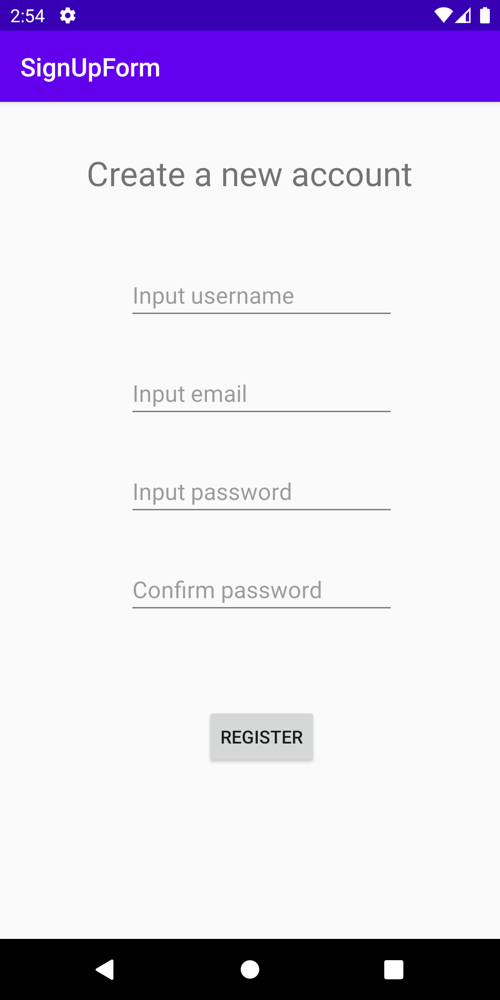
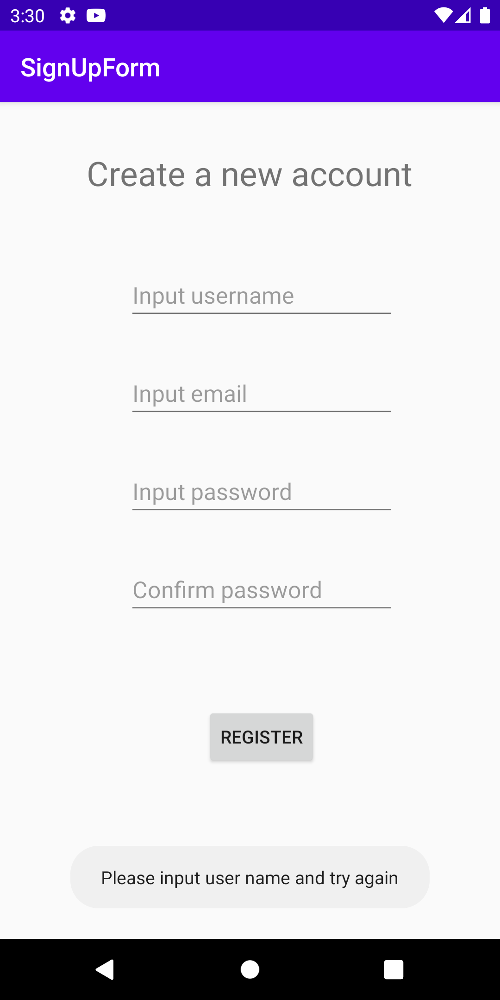
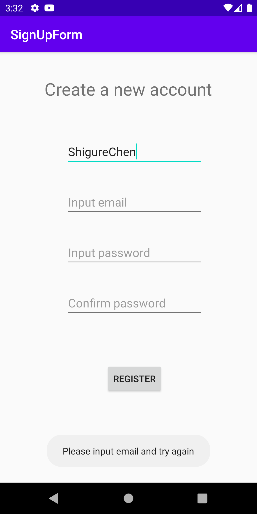
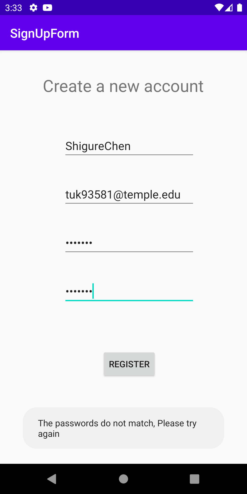
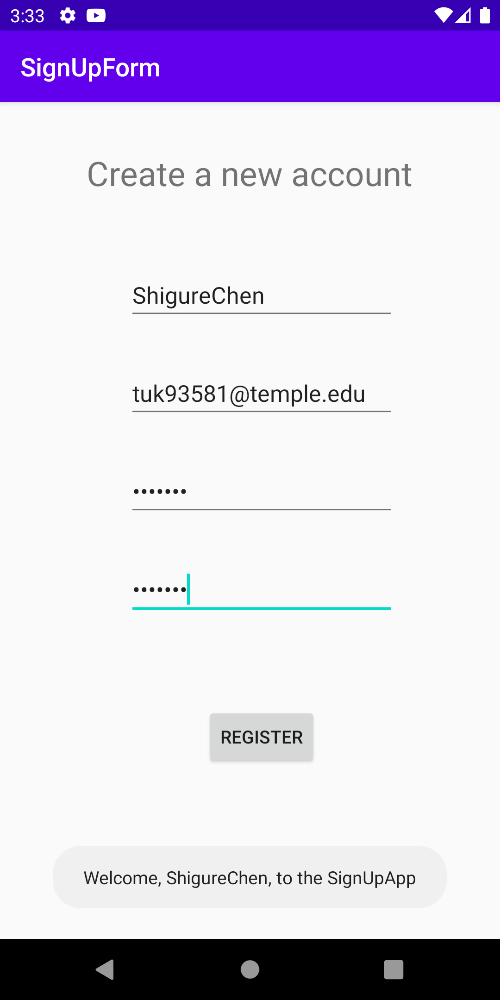

# Assignment 02 Sign Up Form

Instructions:
Create an Android application to collect a user’s name, email, a password, and a password confirmation. It also contains a Save button.
Afterwords it will display a message containing the user’s name, welcoming them to the app. e.g. “Welcome, Jane Dough, to the SignUpForm App”

# Application Function

This app contains a single activity (FormActivity). Looks like this

Instead of using textViews, hint of editText was used to show the property of the element and prompt the user what kind of information should they enter.

Once the user did not input any information and hit register button. The application will print a toast message looks like this.

or if the user forgot to enter e-mail address.

or if the user did not put identical passwords.

Once the user make no mistake on their basic personal information, the application will print out the welcome message.

